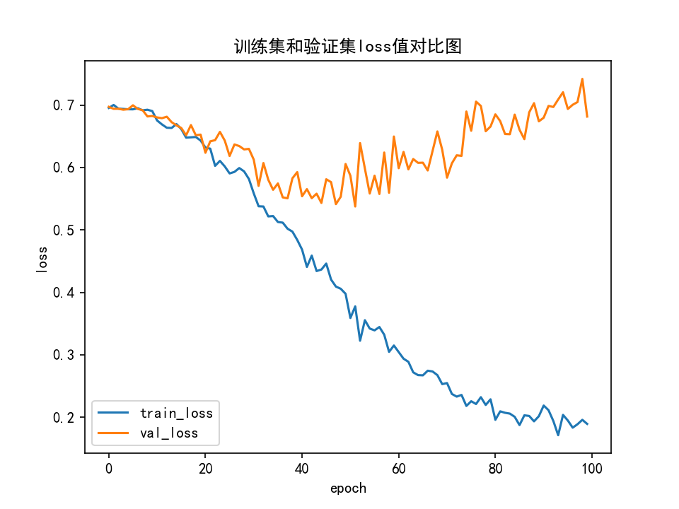
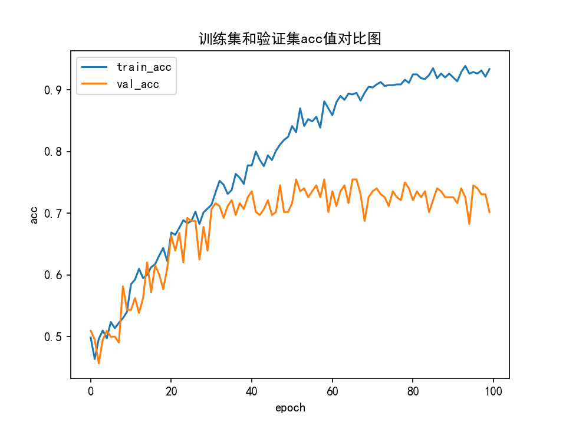

# AlexNet-CIF10-CatDog 🐱🐶

基于 **PyTorch** 从零实现的 AlexNet，在 **CIFAR-10** 数据集上提取猫狗图片进行二分类训练，并提供 **Tkinter 图形化推理界面**。

> 📌 这是一个**入门级教学项目**，完整覆盖：数据准备 → 模型搭建 → 训练 → 可视化评估 → GUI 推理部署全流程。

---

## 📂 项目结构

```
AlexNet/
├── net.py                  # AlexNet 模型定义 (MyAlexNet)
├── train.py                # 训练脚本 (含数据增强、学习率调度、loss/acc曲线)
├── test01.py               # Tkinter GUI 推理脚本 (选择图片预测 / 验证集随机测试)
├── prepare_data.py         # 从 CIFAR-10 pickle 中提取猫狗图片各 500 张
├── split_data.py           # 将图片按 8:2 划分为 train / val
├── artifacts/               # 训练产出物 (曲线图等)
│   ├── acc_curve.png       # 准确率曲线
│   └── loss_curve.png      # Loss曲线
├── save_model/
│   ├── best_model1.pth     # 验证集上最佳模型权重
│   └── last_model1.pth     # 最后一轮模型权重
├── cifar10/                # CIFAR-10 原始数据集 (需自行下载)
│   └── cifar-10-batches-py/
│       ├── data_batch_1~5
│       ├── test_batch
│       └── batches.meta
├── data_name/              # 提取后的猫狗图片 (prepare_data.py 生成)
│   ├── cat/ (500张)
│   └── dog/ (500张)
├── data/                   # 划分后的训练/验证集 (split_data.py 生成)
│   ├── train/
│   │   ├── cat/ (400张)
│   │   └── dog/ (400张)
│   └── val/
│       ├── cat/ (100张)
│       └── dog/ (100张)
└── .gitignore
```

---

## 🧠 模型架构

`net.py` 中的 `MyAlexNet` 是经典 AlexNet 的简化适配版，输入为 `3×224×224` 图像，输出为二分类 logits：

| 层 | 类型 | 参数 | 输出尺寸 |
|---|------|------|---------|
| c1 | Conv2D | 3→48, 11×11, s=4, p=2 | 48×54×54 |
| c2 | Conv2D | 48→128, 5×5, s=1, p=2 | 128×54×54 |
| s2 | MaxPool2D | k=2 | 128×27×27 |
| c3 | Conv2D | 128→192, 3×3, s=1, p=1 | 192×27×27 |
| s3 | MaxPool2D | k=2 | 192×13×13 |
| c4 | Conv2D | 192→192, 3×3, s=1, p=1 | 192×13×13 |
| c5 | Conv2D | 192→128, 3×3, s=1, p=1 | 128×13×13 |
| s5 | MaxPool2D | k=3, s=2 | 128×6×6 |
| f6 | Linear | 4608→2048 | 2048 |
| f7 | Linear | 2048→2048 | 2048 |
| f8 | Linear | 2048→1000 | 1000 |
| f9 | Linear | 1000→**2** | 2 |

> 💡 相比原始 AlexNet（双 GPU 分支），此处做了简化为单路结构，并适配了 224×224 输入和猫狗二分类输出（1000→2）。

---

## ⚙️ 环境要求

- Python 3.8+
- PyTorch ≥ 1.10
- torchvision
- numpy
- Pillow
- matplotlib
- tkinter（Python 自带，Windows/Linux 通常预装）

**快速安装依赖：**

```bash
pip install torch torchvision numpy pillow matplotlib
```

---

## 🗂️ 数据准备

### 方式一：自动提取（推荐）

项目从 **CIFAR-10** 中提取猫（label=3）和狗（label=5）图片各 500 张。

1️⃣ **获取 CIFAR-10 pickle 文件**，放到 `cifar10/cifar-10-batches-py/`：

```bash
# 方式 A：GitCode 镜像（国内推荐）
git clone https://gitcode.com/open-source-toolkit/94ecd.git tmp
# 解压 RAR 文件到 cifar10/ 目录
# 方式 B：官网下载
wget https://www.cs.toronto.edu/~kriz/cifar-10-python.tar.gz
tar -xzf cifar-10-python.tar.gz -C cifar10/
```

2️⃣ **提取猫狗图片：**

```bash
python prepare_data.py
```
→ 从本地 pickle 读取，在 `data_name/cat/` 和 `data_name/dog/` 各生成 500 张 32×32 图片。

3️⃣ **划分训练集 & 验证集（8:2）：**

```bash
python split_data.py
```
→ 生成 `data/train/cat/` (400张), `data/train/dog/` (400张), `data/val/cat/` (100张), `data/val/dog/` (100张)。

### 方式二：用自己的数据

直接在 `data/train/` 和 `data/val/` 下按类别建子目录存放图片即可，支持 jpg/png 等常见格式。

---

## 🚀 训练

```bash
python train.py
```

### 训练配置

| 参数 | 值 |
|------|-----|
| 输入尺寸 | 224×224 |
| Batch size | 16 |
| 优化器 | SGD (lr=0.01, momentum=0.9) |
| 学习率调度 | StepLR, 每 10 轮 ×0.5 |
| 损失函数 | CrossEntropyLoss |
| Epochs | 100 |
| 数据增强 | RandomHorizontalFlip, ColorJitter, RandomRotation(10°) |

### 训练特性

- ✅ **自动保存最佳模型** — 验证集准确率最高时保存到 `save_model/best_model1.pth`
- ✅ **学习率衰减** — 每 10 轮学习率减半，帮助收敛
- ✅ **Loss/Acc 曲线** — 训练结束后自动生成到 `artifacts/` 目录

---

## 🖥️ GUI 推理

训练完成后，启动**图形化分类器**：

```bash
python test01.py
```

功能：
1. **选择本地图片** — 从文件对话框选择 jpg/png 等图片
2. **开始预测** — 显示预测结果 "cat" 或 "dog"
3. **随机测试验证集 10 张** — 从验证集随机抽 10 张图片，依次显示并输出预测结果到控制台

> 💡 截图示例：运行后选择一张猫/狗图片即可看到预测结果（可自行截图放入 `artifacts/screenshot.png`）

---

## 📈 训练结果示例

训练 100 轮后典型的 loss 和 accuracy 曲线：

| Loss 曲线 | Accuracy 曲线 |
|:---:|:---:|
|  |  |

> ✅ CIFAR-10 猫狗分类（32×32 原生分辨率上采样到 224×224），验证集准确率可达 **~75%**（最佳 75.48%）。
>
> ⚠️ CIFAR-10 图片分辨率较低（32×32），上采样到 224×224 会有信息损失，如果想获得更高准确率，建议使用真实高清猫狗数据集（如 Kaggle Dogs vs Cats）。

---

## 📚 参考

- [AlexNet 原论文](https://papers.nips.cc/paper/2012/hash/c399862d3b9d6b76c8436e924a68c45b-Abstract.html) — ImageNet Classification with Deep Convolutional Neural Networks
- [CIFAR-10 数据集](https://www.cs.toronto.edu/~kriz/cifar.html)
- [PyTorch 官方文档](https://pytorch.org/docs/stable/)

---

## 📄 License

MIT
